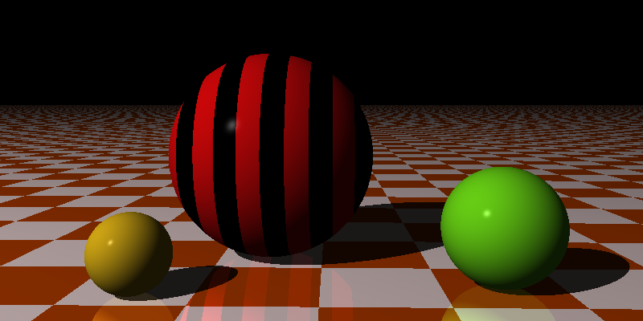
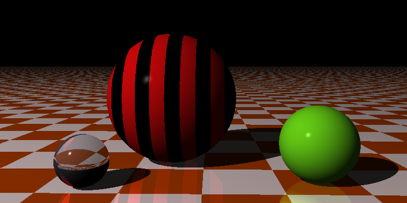
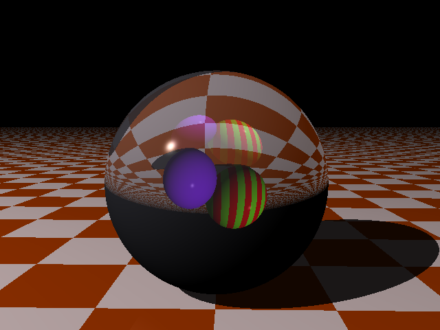
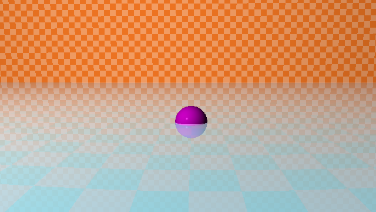

## Reflection and Refraction

Reflection first. The surface now reflects the spheres.

Refraction in action. We can see how the glass sphere bends the light.

Why the bottom part of the glass sphere is black? That's because the glass sphere inverts the scene, the black part is actually the black "sky" above. In other words, when we look at the glass sphere, we see an upside-down mini version of the scene.

Here's a better scene to showcase refraction with two opaque spheres behind one large transparent sphere (we can call it a crystal ball).

Final scene of this chapter is an example of Fresnel effect (implemented using Schlick's approximation  algorithm). Assume we have a pond (simulated by a transparent and reflective plane). The bottom of the pond looks like a chessboard with teal color. Let's say the time of day is near dusk so the horizon has an orange-ish color. In the middle of the pond somehow there's a purple ball floating.

What does Fresnel effect mean here? If we look at the water close to us, the water appears transparent. We can look through to the bottom and see a (dark) teal color. However, far away from us, the water is no longer transparent. It instead reflects the sky, and the water has an orange-ish color. Basically, Fresnel effect is the dynamic between reflection and refraction in a medium that is both transparent and reflective.
