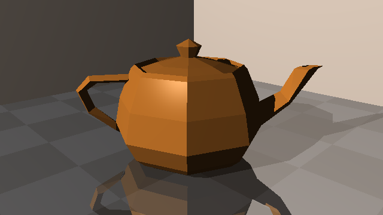

## Triangles

Low-poly Utah Teapot with 240 triangles.
(model: https://graphics.cs.utah.edu/courses/cs6620/fall2013/prj05/teapot-low.obj)

The same teapot model above but with smooth triangles. The surface of the teapot now looks smooth. However, due to the low quality of the model (not enough triangles), it does not look right.

Optimization is required to accelerate the renderer. I will render a high-poly version of the same teapot later.